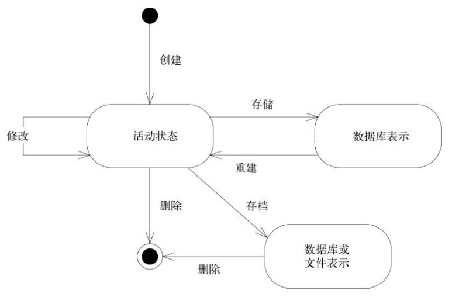

# 运用领域模型
## 1. 消化知识
* **有效建模的要素**
    * 模型和实现的绑定
    * 建立一种基于模型的语言
    * 开发一个蕴含丰富知识的模型
    * 提炼模型
    * 头脑风暴和实验
* **知识消化** 高效的领域建模人员是知识的消化者，模型在不断改进的同时，也成为组织项目信息流的工具
* **持续学习**
* **知识丰富的设计**
* **深层模型** 知识消化是一种探索，它永无止境

## 2. 交流与语言的使用
* **UBIQUITOUS LANGUAGE（通用语言）**
    * 将模型作为语言的支柱。确保团队在内部的所有交流中以及代码中坚持使用这种语言。
    * 通用语言的更改就是对模型的更改。通过尝试不同的表示方法来消除难点，然后重构代码，重新命名类、方法和模块，以便和新模型保持一致。
* **“大声地”建模** 改善模型的最佳方式之一就是通过对话来研究
* **一个团队，一种语言** 开发人员之间的对话、领域专家之间的讨论以及代码本身所表达的内容都基于同一种语言，都来自于一个共享的领域模型
* **文档和图** 
    * 模型不是图，图的目的是帮助表达和解释模型。设计的重要细节应该在代码中体现出来，不能强制用图来表示全部模型或设计。
    * 文档应作为代码和口头交流的补充，并保持最新。文档不应重复表达代码已经明确表达的内容，代码已经含有各个细节。
    * 代码的行为是不会改变的，但是变量和代码组织方式表达的意思不一定严格，也就是言行未必一致，可能产生误导。
* **解释性模型** 解释性模型不必是对象模型，并且最好不是，可以以一种不同的方式来呈现领域，有助于人们学习。

## 3. 绑定模型和实现
领域驱动设计要求模型不仅能够指导早期的分析工作，还应该成为设计的基础。
* **Model-Driven Design**
    * 软件系统各个部分的设计应该忠实地反映领域模型，并且软件可以自然地实现模型
    * 从模型中获取用于程序设计和基本职责分配的术语，让程序代码成为模型的表达
* **建模范式和工具支持**
* **为什么模型对用户至关重要**
* **Hands-On Modeler** 
    * 亲身实践的建模者，软件开发就是设计
    * 将分析、建模、设计和编程工作过度分离会对Model-Driven Design产生不良影响

# 模块驱动设计的构造块
## 4. 分离领域
* **Layered Architecture**
    * 用户界面层/表示层 -> 应用层/无知识，协调任务 -> 领域层/模型层 -> 基础设施层
    * 给复杂的应用程序划分层次，在每一层分别进行设计，使其具有内聚性并且只依赖于它的下层
* **领域层是模型的精髓**
* **The Smart UI "反模式"** 可以适用于简单应用

## 5. 软件中所表示的模型
* **Entity**
    * 实体在整个生命周期中具有连续性（最基本的职责）
    * 实体的区别不是由对用户非常重要的属性决定的（如果有标识区分，应该主要通过标识来确定该对象的定义）
* **Value Object**
    * 值对象所包含的属性应该形成一个整体概念。（比如city，country是address的一部分）
    * 值对象可以是其他对象的集合，甚至可以引用Entity
    * 值对象经常作为参数在对象之间传递消息
    * 当我们只关心一个模型元素的属性时，应把它归类为值对象。值对象应该是不可变的，不要为它分配任何标识
    * 值对象的设计
        * 值对象的共享（复制VS共享，性能优化）
        * 值对象的可变性（在特殊情况下，值对象可能允许可变性）
* **Service**
    * 有的设计会包含一些特殊的操作，不属于任何对象，这时候可以引入Service
    * Service往往以一个活动来命名，而不是以一个Entity来命名，是动词而不是名词
    * 好的Service有三个特征
        * 与领域概念相关的操作不是Entity或Value Object的一个自然组成部分
        * 接口是根据领域模型的其他元素定义的
        * 操作是无状态的
    * Service可以划分到不同的层中，也可以控制接口的粒度。大型系统中，中等粒度的、无状态的Service更容易被复用。
* **Module**
    * 使用Module的主要原因是“认知超载”，Module为人们提供了两种观察模型的方式，一个是在Module中查看细节，而不被整个模型淹没。二是观察Module之间的关系，而不考虑其中细节。
    * Module应该是高内聚，低耦合的
* **建模范式**
    * 对象范式
    * 对象世界中的非对象
    * 在混合范式中坚持使用Model-Driven Design

## 6. 领域对象的生命周期

* **Aggregate**
    * Aggregate是一组相关对象的集合，每个聚合都有一个root和一个boundary，边界定义了Aggregate内部有什么，根则是Aggregate所包含的一个特定Entity
    * 对Aggregate而言，外部对象只可以引用根，而边界内部的对象之间则可以互相引用
    * Aggregate划分出一个范围，在这个范围内，生命周期的每个阶段都必须满足一些固定规则（invariant）。固定规则是指在数据变化时必须保持的一致性规则
* **Factory**
    * 当创建一个对象或者创建整个Aggregate时，如果创建工作很复杂，或者暴露了过多的内部结构，可以使用Factory封装
    * 对象的创建本身可以是一个主要操作，但被创建的对象并不适合承担复杂的装配操作。将这些职责混在一起可能产生难以理解的拙劣设计。让客户直接负责创建对象又会使客户的设计陷入混乱，并且破坏被装配对象或Aggregate的封装，而且导致客户与被创建对象的实现之间产生过于紧密的耦合。
    * 好的Factory都需满足以下两个基本需求：
        * 每个创建方法都是原子的，并且要保证被创建对象或者Aggregate的所有固定规则
        * Factory应该被抽象为所需的类型
    * 有的情况下只需使用构造函数，Factory会使那些不具有多态性的简单对象复杂化
    * Factory封装了对象创建和重建时的生命周期转换
* **Repository**
    * 客户需要一种有效的方式来获取对已存在的领域对象的引用
    * 在所有持久化对象中，有一小部分必须通过基于对象属性的搜索来全局访问
    * 技术基础设施和数据库访问机制的暴露会增加客户的复杂度，并妨碍模型驱动的设计
    * Repository将某种类型的所有对象表示为一个概念集合，它的行为类似于集合，只是具有更复杂的查询功能
    * Repository的优点
        * 提供一个简单模型，可用来获取持久化对象并管理他们的生命周期
        * 使应用程序和领域设计和持久化技术解耦
        * 体现了有关对象访问的设计决策
        * 容易替换为“哑实现”，以便在测试中使用
    * Repository管理对象生命周期的中间和结束
* **为关系数据库设计对象**

## 7. 使用语言：一个扩展的示例
* **货物运输系统简介**
    * Cargo 货物
    * Customer
    * Delivery Specification
    * Delivery History
    * Handling Event
    * Carrier Movement
    * Location
* **隔离领域：引入应用层**
    * Tracking Query 跟踪查询，访问某个Cargo过去和现在的处理情况
    * Booking Application 预订应用，允许注册一个新的Cargo
    * Incident Logging Application 事件日志应用，记录对Cargo的每次处理
    * 这些应用层类是协调者，它们只负责提问，不负责回答，回答是领域层的工作
* **将实体和值对象区分开**
    * Entity：Customer， Cargo， Handling Event， Carrier Movement， Location
    * Aggregate：Delivery History
    * Value Object：Delivery Specification，Role，etc
* **设计运输领域中的关联**
* **Aggregate边界**
* **选择Repository**
* **场景走查**
* **对象的创建**
* **重构：Cargo Aggregate的另一种设计**
* **运输模型中的Module**
* **引入新特性：配额检查**

# 通过重构来加深理解
有些重构能够极大地提高系统的可用性，它们要么源于对领域的新认知，要么能够通过代码清晰地表达出模型的含义。
深层模型能够穿过领域表象，清楚地表达出领域专家们的主要关注点以及最相关的知识。

## 8. 突破
* **一个突破的故事**
* **机遇** 突破出现的时机可能很不合时宜
* **关注根本** 不要试图制造突破，而要为突破做好准备，专注于知识消化，建立健壮的通用语言
* **后记：越来越多的新理解**

## 9. 将隐式概念转变为显式概念
如果开发人员识别出设计中隐含的某个概念或是在讨论中受到启发而发现一个概念时，就会对领域模型和相应的代码进行许多转换，在模型中加入一个或多个对象或关系，从而将此概念显式地表达出来。
* **9.1 概念挖掘**
    * 倾听语言
    * 检查不足之处
    * 思考矛盾之处
    * 查阅书籍
    * 尝试，再尝试
* **如何为那些不太明显的概念建模**
    * 显式的约束
    *  

# 战略设计
